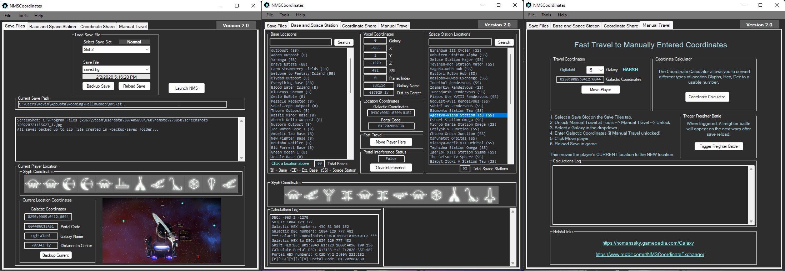

# NMSCoordinates
This a Coordinate Tool for No Man's Sky!

|               NMSC                        |
|                :---:                      |
|              |

* [More Screenshots - Here](https://github.com/Kevin0M16/NMSCoordinates/tree/master/images)

# NMSCoordinates

NMSCoordinates is an app for No Man’s Sky which allows you to view all your discovered space station and base locations between all your saves.
You can clear portal interference while traveling through a portal, fast travel to known locations, or manually enter Galactic Coordinates and travel to them.
Backup locations to txt file and and access and travel to these saved coordinates.

## Youtube Videos

|Example Videos|  |
|:---:|:---:|
|Portal Interference|Travel Mode|
|||
|Manual Travel|Fast Travel|
|||

## Download - UPDATE v1.1.11 (12-12-2019)

Added a New Feature: Users can now trigger a freighter battle on the next warp after save reload. Button on the Manual Travel Tab.

<!--* Download will be available later today. -->
<pre>  </pre>

## Share - Upload locations to Google Drive

* [Google Drive Folder - NMSCoordinates](https://drive.google.com/open?id=0B0Tsv8SX6_GtR2hKNlhVcnBvMmc) Add your locbackup.txt files here to share. Adding your name at the end of the filename is ok.

## Features

* Trigger a Freighter Battle.
* View all space station and base locations discovered across all save slots and see their Glyphs, Galactic Coordinates, Portal Code, and even Voxel X,Y,Z,SSI
* Fast travel to any selected location in the list of discoveries.
* Enable Manual Travel and manually enter Galactic Coordinates and Galaxy that you need to travel to.
* Enable Travel Mode and save a record of all your locations the game deletes when traveling through a terminus or when hitting the limit.
* Portal interference can be cleared with a button, so base building and the galaxy map are allowed after traveling through a portal.
* Save a record of the players current location in a .txt and access it later on the Coordinate Share tab.
* Can Backup all locations to a .txt file. You can access these on the Coordinate Share tab or share with others. You can fast travel to these also.
* NMSCoordinates backs up your entire save folder on startup, the .zip is located in the .\backup folder.
* Manage these NMSC .zip backups in the Save Manager.
* You can view the last 4 screenshots taken in the game within the tool. It displays 1 on front and all 4 can be accessed in Tools --> Screenshot Page.
* NMSCoordinates shows all calculation results in the textbox, if you like HEX and DEC.
* NMSCoordinates Calculator is a useful tool when messing with coordinates. This converts Portal->Galactic, Galactic->Portal, Voxel to Portal/Galactic. Check it out!
* NMSCoordinates checks for the latest version and shows at the top-right if a newer version is available.

## Getting Started

Here is an overview of what you need to get started with NMSCoordinates

### Requirements

The current version of NMSCoordinates requires No Man's Sky Beyond or Synthesis 2.2-2.23

:exclamation: **Always back up all your game data and saves before any mods**

### Installation and setup

	1. (Optional NMSC backups up saves on startup) Backup all you save files at Location: C:\Users\[Name]\AppData\Roaming\HelloGames\NMS\st_xxxxxxxxx
	2. Download the latest release .zip file.
	3. Extract the .zip to your desired location.
	4. Create a shortcut to NMSCoordinate.exe for your desktop.
	5. Run NMSCoordinate.exe. 
	6. Select Save slot, and have fun!

### Instructions

* Select a Save Slot. This loads all space station and base locations on that slot/save on the Base and Space Station tab.
* Click a location in one of the Listboxes to view the location info. Glyphs and Galactic Coordinates, Portal Code, and Voxel will be displayed.
* Move player to that location by clicking the Move Player Here button, then RELOAD YOUR SAVE in NMS.
* If you traveled through a portal and want to clear the Portal Interference, click the Clear Interference button, then RELOAD YOUR SAVE in NMS.
* Enable Manual Travel to travel to any valid coordinates. On the Manual Travel Tab, Select a galaxy then enter Galactic Coordinates, then click the move player button.
* Trigger a Freighter Battle by clicking the "Trigger Freighter Battle" button on the Manual Travel tab, then RELOAD YOUR SAVE in NMS.
* Go to File --> Backups --> backup discoveries to .txt and save all your locations to a txt file in .\backup. These are accessed on the Coordinate Share Tab.
* View location files on the Coordinate Share tab by double-clicking the file or the load lockbackup button. Click a location to view a location summary, and click the Move Player Here button to fast travel to the selected location.
* Right-click a location in the top Listbox on the Coordinate Share tab to create a one record location file to share with others or delete single records.
* Right-click the lower Listbox on the Coordinate Share tab to delete unwanted location files.
* Use the Coordinate Calculator by clicking the Coordinate Calculator button and entering (1) coordinate at a time in the textboxes and clicking the button below it. View all converted coordinates at the bottom.
* On the Coordinate Calculator, clicking the glyphs will populate the Portal Code field. Then click calculate to see the coordinates.
* Enable Travel Mode to start tracking your Terminus locations before traveling through a terminus or when hitting the limit. See video above.

## Change Log
* [Changelog](https://github.com/Kevin0M16/NMSCoordinates/blob/master/CHANGELOG.md) - For viewing version history.

## Built With

* [Visual Studio 2019](https://visualstudio.microsoft.com/downloads/) - For the Windows 10 UI
* [Notepad++](https://notepad-plus-plus.org/) - For viewing Json
* [WinMerge](https://winmerge.org/) - Awesome tool for file comparison

## Authors

* **Kevin Lozano** - *Initial work* - [Kevin0M16](https://github.com/Kevin0M16)

## License

This project is licensed under the MIT License - see the [LICENSE](/LICENSE.txt) file for details

## Acknowledgments

* [nmssavetool](https://github.com/matthew-humphrey/nmssavetool) - Used the save file classes - This tool is still awesome!
* [octokit](https://github.com/octokit/octokit.net) - Used to check for an updated version.
* [NMSSaveEditor](https://github.com/goatfungus/NMSSaveEditor) - For viewing raw Json and testing my tool, also shout out to goatfungus for answering a few questions!
* [Swiss-Selector](https://kevin0m16.github.io/Swiss-Selector/) - For some code and examples. (My Car Mechanic tool)
* [r/NoMansSkyMods](https://www.reddit.com/r/NoMansSkyMods/) - For coordinate conversion info
* [nmsportals](https://nmsportals.github.io/) - For Glyph images
* [NMSGamepedia](https://nomanssky.gamepedia.com/Galaxy) - for galaxy numbers to names
* [NMSPortals](https://github.com/nmsportals/nmsportals.github.io) - for coordinate validation calculation math.
