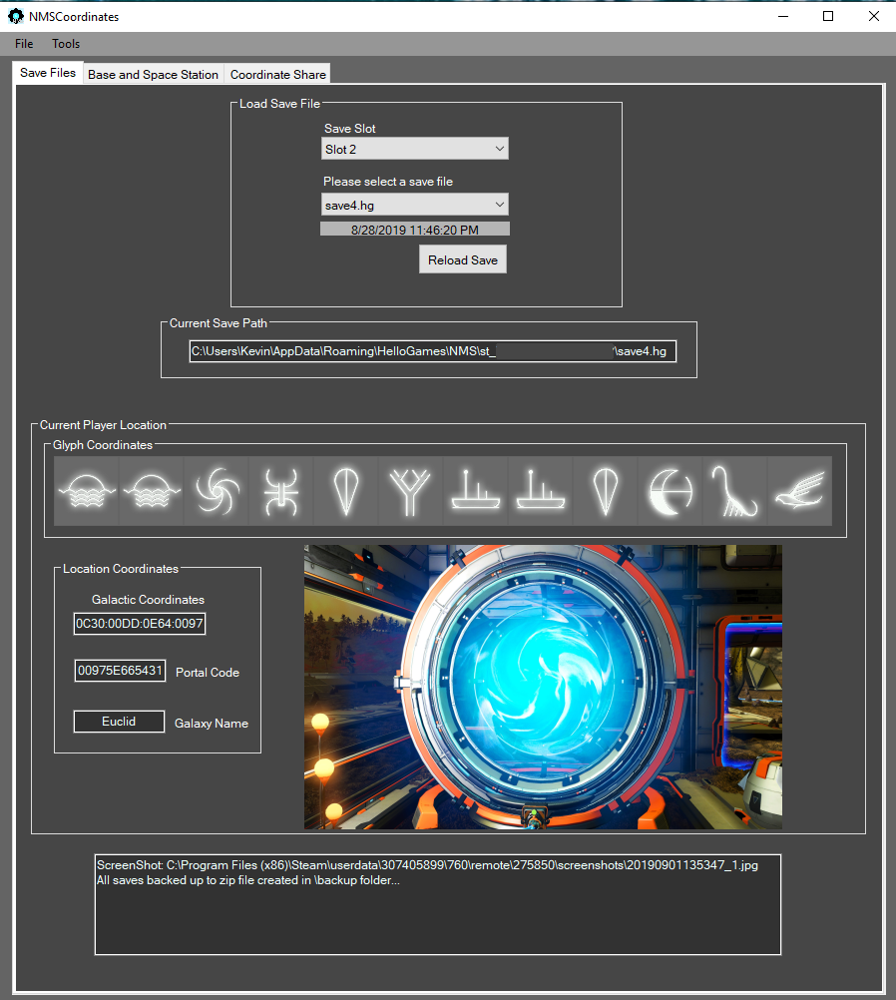
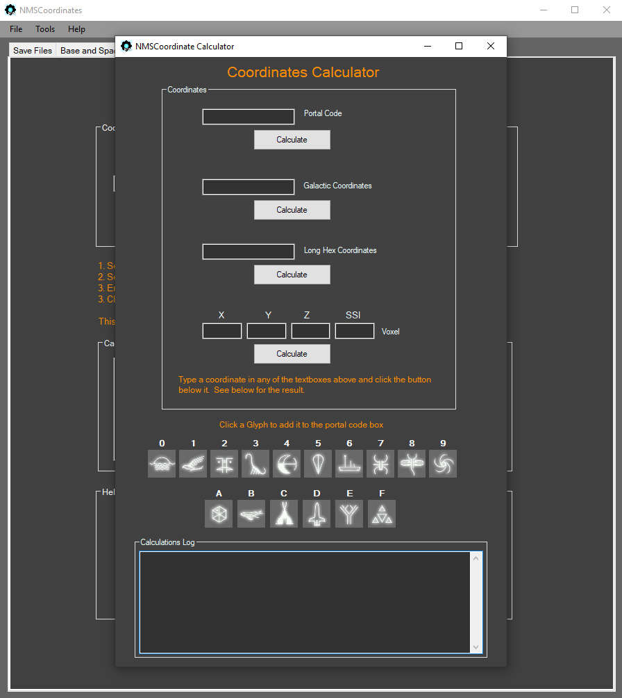
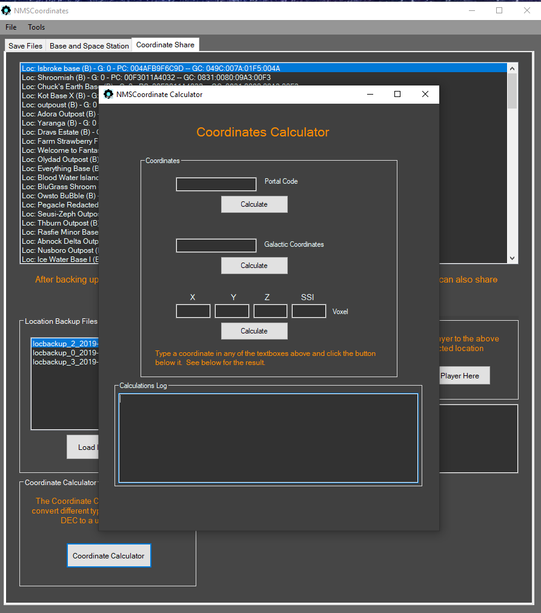

# NMSCoordinates
This a Coordinate Tool for No Man's Sky!

|    Screenshots      |                     |
|     :---:           |     :---:           |
|||	
|||

# NMSCoordinates
No Man's Sky Coordinate tool allows you to view all your discovered space station and base locations between all your saves.
You can clear portal interference while traveling and fast travel to all the locations that you have discovered or have been shared with you!

## Youtube Video - Travel Mode example

## Youtube Video - Fast Travel example

## Download

<!--* Download will be available later today. -->

<pre>  </pre>

## Share - Upload locations to Google Drive

* [Google Drive Folder - NMSCoordinates](https://drive.google.com/open?id=0B0Tsv8SX6_GtR2hKNlhVcnBvMmc) Add your locbackup.txt files here to share. Adding your name at the end of the filename is ok.

## Features
* View all space station and base locations discovered across all save slots and see their Glyphs, Galactic Coordinates, Portal Code, and even Voxel X,Y,Z,SSI
* Fast travel to any selected location in the list of discoveries.
* Enable Manual Travel and manually enter Galactic Coordinates and Galaxy that you need to travel to.
* Enable Travel Mode and keep all your locations the game deletes when traveling through a terminus.
* Portal interference can be cleared with a button, so base building and the galaxy map are allowed after traveling through a portal!
* Can Backup all locations to a .txt file. You can access these on the Coordinate Share tab or share with others. You can fast travel to these also!
* NMSCoordinates backs up your entire save folder on startup, the .zip is located in the .\backup folder.
* You can view the last 4 screenshots taken in the game within the tool. It displays 1 on front and all 4 can be accessed in Tools --> Screenshot Page.
* NMSCoordinates shows all calculation results in the textbox, if you like HEX and DEC.
* NMSCoordinates Calculator is a useful tool when messing with coordinates. This converts Portal->Galactic, Galactic->Portal, Voxel to Portal/Galactic. Check it out!

## Getting Started
Here is an overview of what you need to get started with NMSCoordinates

### Requirements

The current version of NMSCoordinates requires No Man's Sky Beyond 2.11, but It could work with older versions.
 - [x] nmssavetool required - download the lasted NMSCoordinates release .zip, it's included.

:exclamation: **Always back up all your game data and saves before any mods**

### Installation and setup

	1. Backup all you save files! C:\Users\[Name]\AppData\Roaming\HelloGames\NMS\st_xxxxxxxxx
	2. Download the lastest release .zip file. Releases at the top ^
	3. Extract the .zip to your desired location.
	4. Open and run NMSCoordinate.exe or create shortcut for your desktop
	5. Select Save slot, and have fun! 

### Instructions

	1. Select a Save Slot. This loads all space station and base locations on that slot/save on the Base and Space Station tab.
	2. Click a location in one of the listboxes to view the location info. Glyphs and Galactic Coordinates, Portal Code, and Voxel will be displayed.
	3. Move player to that location by clicking the Move Player Here button, then reload the save in game that you selected on the first screen.
	4. If you traveled through a portral and want to clear the Portal Interference, click the Clear Interference button, then reload the save selected in game.
	5. Go to File --> Backups --> backup discoveries to .txt and save all your locations to a locbackup file in .\backup these are accessed on the coordinate share tab.
	6. Import a locbackup file on the Coordniate Share tab by clicking the import locbackup txt button. Click a location to view a location summary, and click the Move Player here button to fast travel to the selected locaiton.
	7. Right click a location in the top listbox on the Coordinate Share tab to create a one record locbackup file to share with others.
	8. Right click the lower listbox to delete unwanted locbackup files.
	9. Use the Coordinate Calculator by clicking the Coordinate Calculator button and entering (1) coordinate at a time in the textboxes and clicking the button below it. View all converted coordinates at the bottom.
	10. Enable Travel Mode to start tracking your Terminus locations before traveling through a terminus. See video above.

## Built With

* [Visual Studio 2019](https://visualstudio.microsoft.com/downloads/) - For the Windows 10 UI
* [Notepad++](https://notepad-plus-plus.org/) - For viewing Json
* [WinMerge](https://winmerge.org/) - Awesome tool for file comparison

## Authors

* **Kevin Lozano** - *Initial work* - [Kevin0M16](https://github.com/Kevin0M16)

## License

This project is licensed under the MIT License - see the [LICENSE](/LICENSE.txt) file for details

## Acknowledgments

* [nmssavetool](https://github.com/matthew-humphrey/nmssavetool) - For signing the save files. This tool is still awesome!
* [NMSSaveEditor](https://github.com/goatfungus/NMSSaveEditor) - For viewing raw Json and testing my tool, also shout out to goatfungus for answering a few questions!
* [Swiss-Selector](https://kevin0m16.github.io/Swiss-Selector/) - For some code and examples. (My Car Mechanic tool)
* [r/NoMansSkyMods](https://www.reddit.com/r/NoMansSkyMods/) - For coordinate conversion info
* [nmsportals](https://nmsportals.github.io/) - For Glyph images
* [NMSGamepedia](https://nomanssky.gamepedia.com/Galaxy) - for galaxy numbers to names
